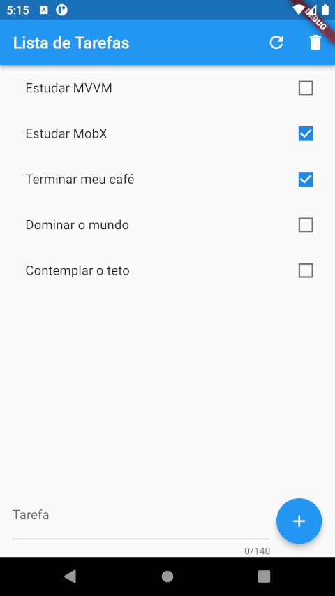
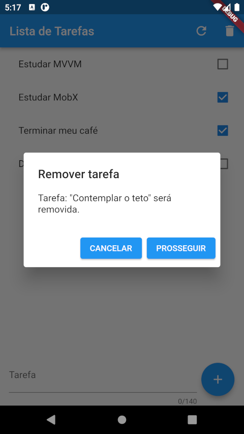
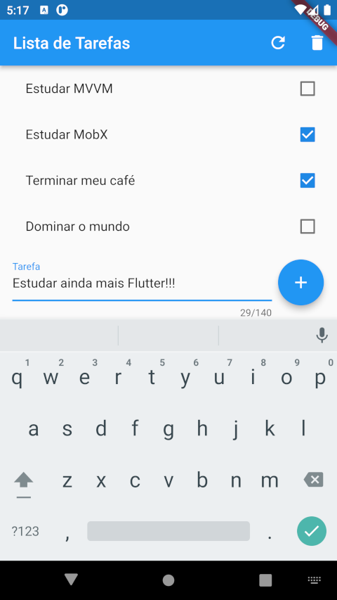

# todolist

Flutter+shared_preferences

Projeto Flutter feito no intuito de aprender mais sobre o desenvolvimento com Dart e o framework Flutter. Nesse projeto aprendi sobre como armazenar informações localmente com shared_preferences. Este foi um dos meu primeiros projetos, após isso aprendi mais sobre arquitetura MVVM, Clean Architecture, reatividade, estruturamento de pastas e várias outras coisas, entretanto ainda não refatorei este APP.

